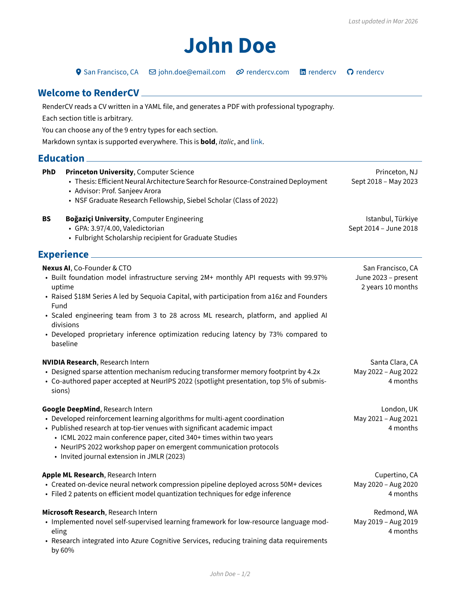
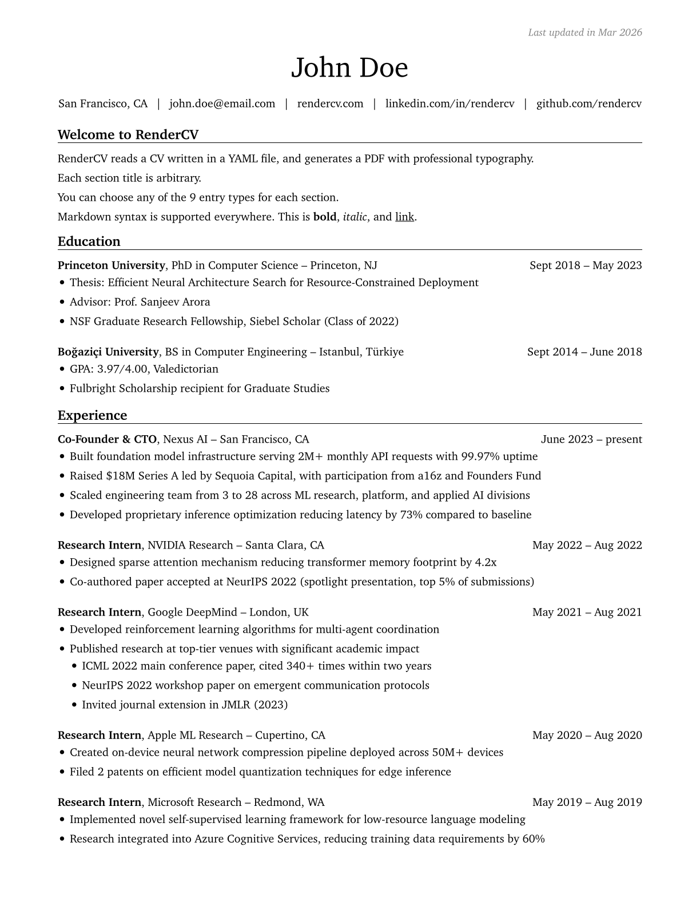
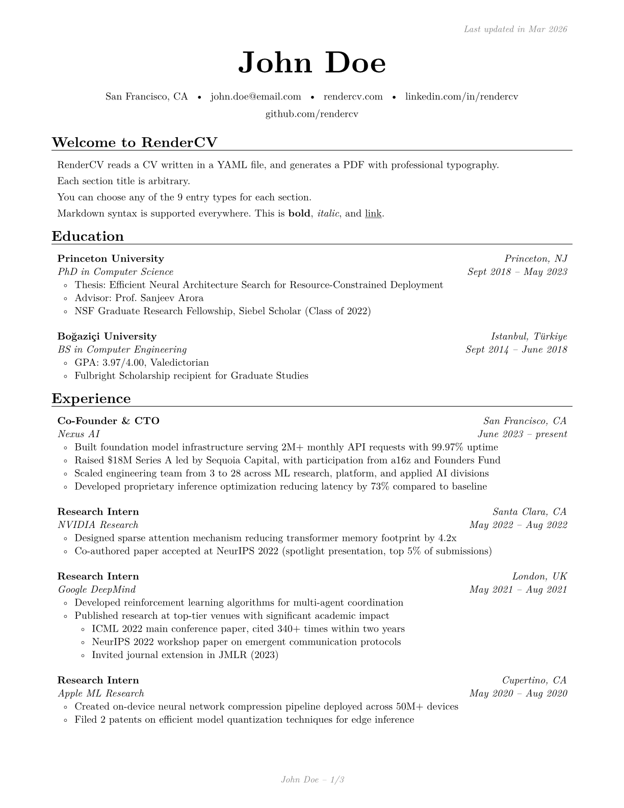
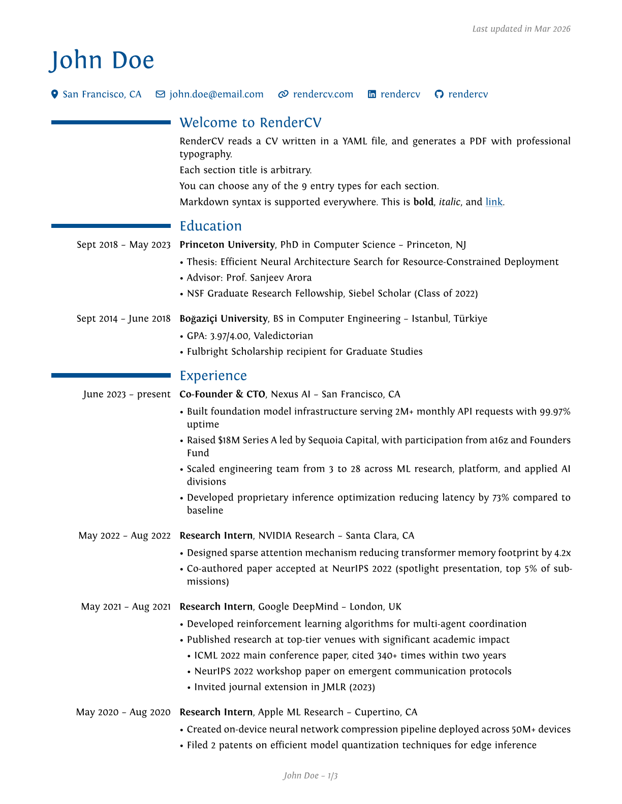
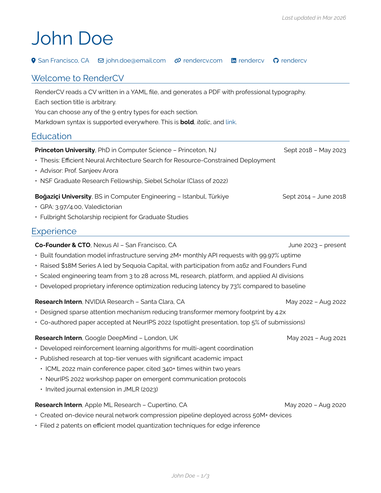
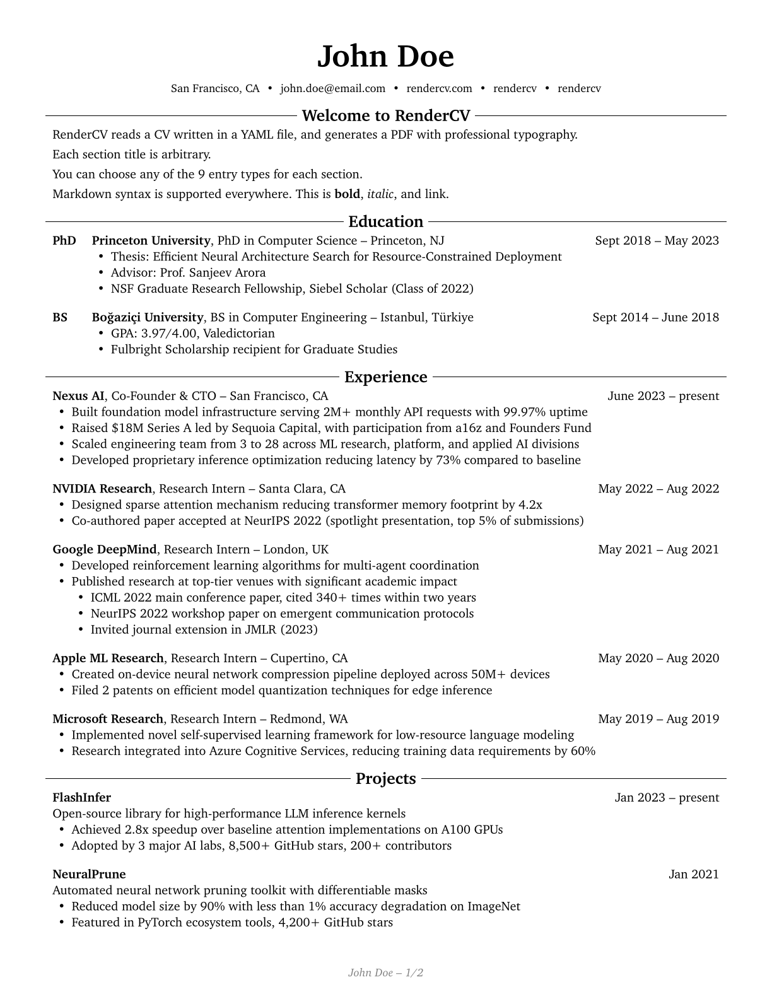
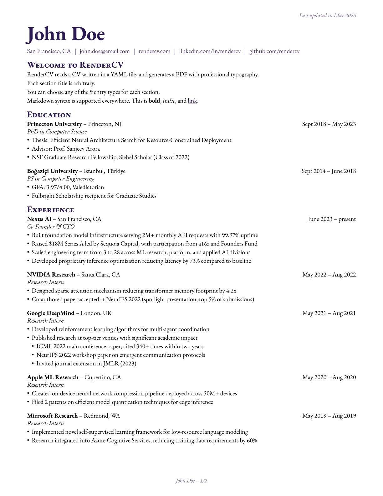
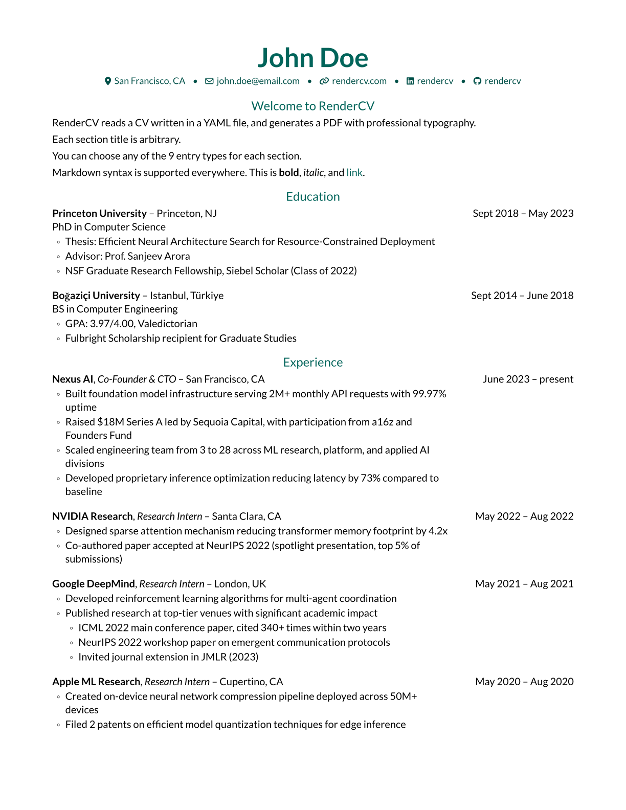
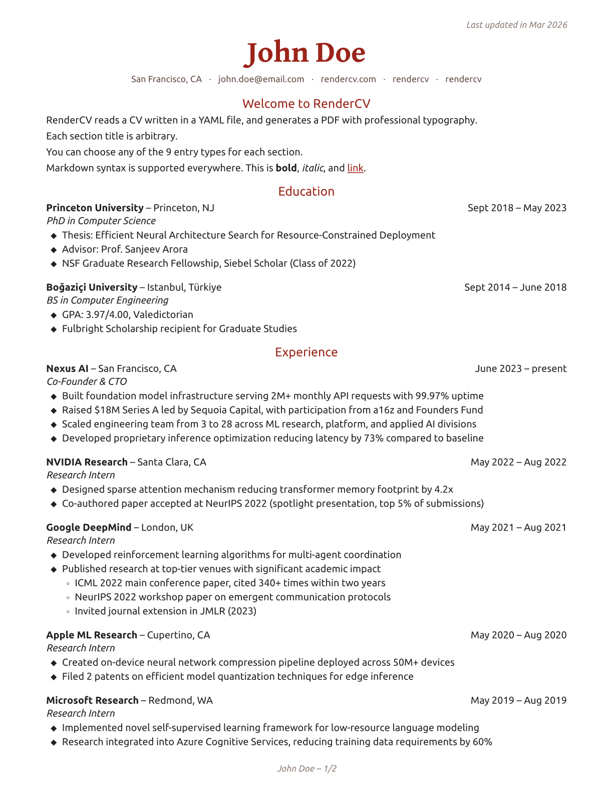

<div align="center">
<h1>RenderCV</h1>

_Generador de CV y currículum para académicos e ingenieros, con entrada en YAML y salida en PDF con tipografía profesional._

[](docs/user_guide/index.md)
[](LICENSE)

</div>

## Atribución

Este proyecto incluye código derivado de RenderCV, creado por Sina Atalay y
colaboradores, bajo licencia MIT. Consulta
[THIRD_PARTY_NOTICES.md](THIRD_PARTY_NOTICES.md) para ver el aviso completo.

## Ejecutar la app completa

Este repositorio contiene el motor/backend Python y la interfaz web en Next.js.

Instala las dependencias del backend:

```bash
uv sync --all-extras
```

Levanta el backend:

```bash
uv run rendercv-web
```

En otra terminal, instala y levanta el frontend:

```bash
cd frontend
npm install
npm run dev
```

Abre [http://localhost:3000](http://localhost:3000). Por defecto, el frontend
usa el backend en `http://127.0.0.1:8000`. Para cambiarlo:

```bash
NEXT_PUBLIC_RENDERCV_API_BASE_URL=http://127.0.0.1:8000 npm run dev
```

Escribe tu CV o currículum en YAML y ejecuta RenderCV:

```bash
rendercv render John_Doe_CV.yaml
```

y obtén un PDF con tipografía profesional.

Con RenderCV puedes:

- Versionar tu CV como texto.
- Enfocarte en el contenido y no en el formato.
- Obtener alineación y espaciado consistentes de forma automática.

Un archivo YAML como este:

```yaml
cv:
  name: John Doe
  location: San Francisco, CA
  email: john.doe@email.com
  website: https://rendercv.com/
  social_networks:
    - network: LinkedIn
      username: rendercv
    - network: GitHub
      username: rendercv
  sections:
    Bienvenido a RenderCV:
      - RenderCV lee un CV escrito en un archivo YAML y genera un PDF con tipografía profesional.
      - Consulta la [documentación](docs/user_guide/index.md) para más detalles.
    education:
      - institution: Princeton University
        area: Computer Science
        degree: PhD
        date:
        start_date: 2018-09
        end_date: 2023-05
        location: Princeton, NJ
        summary:
        highlights:
          - "Thesis: Efficient Neural Architecture Search for Resource-Constrained Deployment"
          - "Advisor: Prof. Sanjeev Arora"
          - NSF Graduate Research Fellowship, Siebel Scholar (Class of 2022)
    ...
```

se convierte en uno de estos PDFs. Haz clic en las imágenes para previsualizar.

| [](examples/John_Doe_ClassicTheme_CV.pdf) | [](examples/John_Doe_EngineeringresumesTheme_CV.pdf) | [](examples/John_Doe_Sb2novTheme_CV.pdf) |
| --- | --- | --- |
| [](examples/John_Doe_ModerncvTheme_CV.pdf) | [](examples/John_Doe_EngineeringclassicTheme_CV.pdf) | [](examples/John_Doe_HarvardTheme_CV.pdf) |
| [](examples/John_Doe_InkTheme_CV.pdf) | [](examples/John_Doe_OpalTheme_CV.pdf) | [](examples/John_Doe_EmberTheme_CV.pdf) |

## Esquema JSON

El esquema JSON de RenderCV te permite completar el YAML de forma interactiva,
con autocompletado y documentación en línea.


## Opciones de diseño

Tienes control total sobre cada detalle.

```yaml
design:
  theme: classic
  page:
    size: us-letter
    top_margin: 0.7in
    bottom_margin: 0.7in
    left_margin: 0.7in
    right_margin: 0.7in
    show_footer: true
    show_top_note: true
  colors:
    body: rgb(0, 0, 0)
    name: rgb(0, 79, 144)
    headline: rgb(0, 79, 144)
    connections: rgb(0, 79, 144)
    section_titles: rgb(0, 79, 144)
    links: rgb(0, 79, 144)
    footer: rgb(128, 128, 128)
    top_note: rgb(128, 128, 128)
  typography:
    line_spacing: 0.6em
    alignment: justified
    date_and_location_column_alignment: right
    font_family: Source Sans 3
  # ...y mucho más
```


> [!TIP]
> ¿Quieres configurar un entorno de vista previa en vivo como el que ves arriba?
> Consulta [cómo configurar VS Code para RenderCV](docs/user_guide/how_to/set_up_vs_code_for_rendercv.md).

## Validación estricta

Sin sorpresas. Si algo no está bien, sabrás exactamente qué y dónde. Si todo es
válido, obtendrás un PDF perfecto.


## Cualquier idioma

Completa el campo `locale` para tu idioma.

```yaml
locale:
  language: spanish
  last_updated: Última actualización
  month: mes
  months: meses
  year: año
  years: años
  present: presente
  phrases:
    degree_with_area: DEGREE en AREA
  month_abbreviations:
    - Ene
    - Feb
    - Mar
    - Abr
    - May
    - Jun
    - Jul
    - Ago
    - Sep
    - Oct
    - Nov
    - Dic
  month_names:
    - Enero
    - Febrero
    - Marzo
    - Abril
    - Mayo
    - Junio
    - Julio
    - Agosto
    - Septiembre
    - Octubre
    - Noviembre
    - Diciembre
  ...
```

## Skill para agentes de IA

Permite que los agentes de IA creen y editen tu CV. Instala el skill de
RenderCV:

```bash
npx skills add rendercv/rendercv-skill
```

Funciona con cualquier agente de IA que soporte el
[estándar de Skills](https://skills.sh). El skill se genera automáticamente a
partir del código fuente de RenderCV y se evalúa con promptfoo sobre el propio
pipeline de validación de Pydantic del proyecto. Consulta
[la documentación](docs/user_guide/how_to/use_the_ai_agent_skill.md) para más
detalles.

## Inicio rápido

Instala RenderCV. Requiere Python 3.12 o superior:

```bash
pip install "rendercv[full]"
```

Crea un nuevo archivo YAML para tu CV:

```bash
rendercv new "John Doe"
```

Edita el YAML y luego renderiza:

```bash
rendercv render "John_Doe_CV.yaml"
```

Si quieres otra lengua o tema desde el inicio, usa:

```bash
rendercv new "John Doe" --locale "spanish" --theme "engineeringresumes"
```

El comando de renderizado genera un directorio `rendercv_output/` con:

- `John_Doe_CV.pdf`: tu CV final en PDF.
- `John_Doe_CV.typ`: el código fuente Typst del PDF.
- `John_Doe_CV_1.png`, `..._2.png`, ...: una imagen PNG por cada página.
- `John_Doe_CV.md`: tu CV en Markdown.
- `John_Doe_CV.html`: tu CV en HTML generado desde Markdown.

Si quieres volver a renderizar automáticamente cada vez que guardes cambios,
usa `--watch`:

```bash
rendercv render --watch "John_Doe_CV.yaml"
```

## Documentación

- [Guía de usuario](docs/user_guide/index.md)
- [Referencia de CLI](docs/user_guide/cli_reference.md)
- [Guía para desarrollo](docs/developer_guide/index.md)
- [Registro de cambios](docs/changelog.md)

## Contribuir

Las contribuciones son bienvenidas. Antes de abrir un pull request:

- Instala las dependencias con `just sync`.
- Ejecuta `just test` para validar la suite.
- Ejecuta `just check` para revisar lint, tipos y hooks.
- Ejecuta `just format` antes de enviar cambios de estilo.
- Si cambias salidas generadas, regenera los archivos de referencia con
  `just update-testdata`.

## Licencia

Este proyecto se distribuye bajo la licencia MIT. Consulta
[LICENSE](LICENSE).

## Avisos de terceros

El proyecto incluye software de terceros y código derivado. Consulta
[THIRD_PARTY_NOTICES.md](THIRD_PARTY_NOTICES.md).
